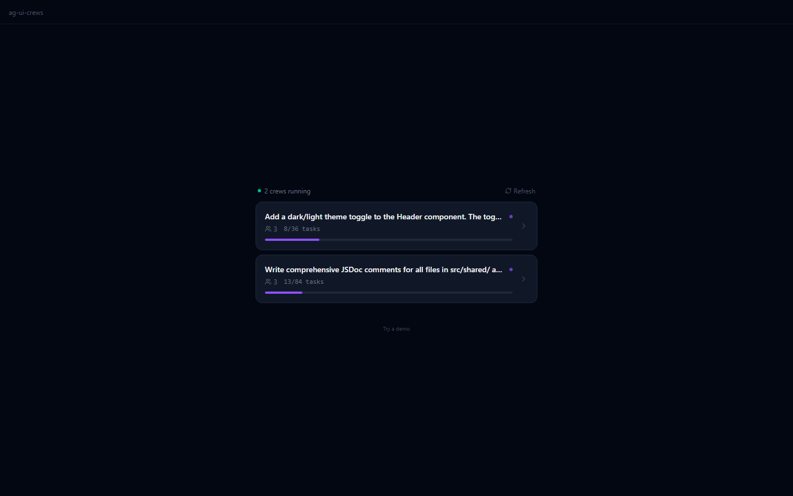
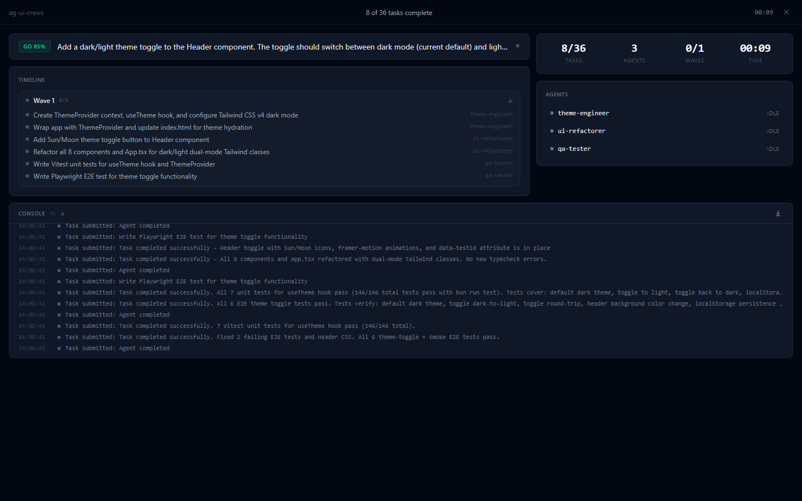
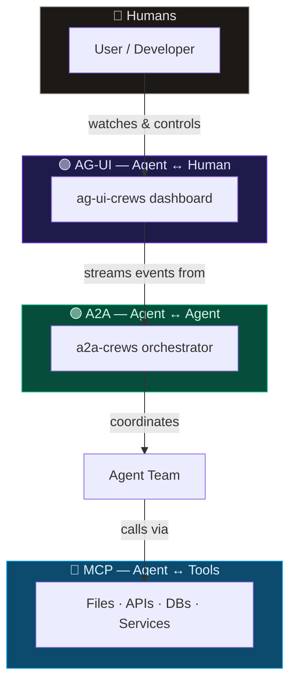
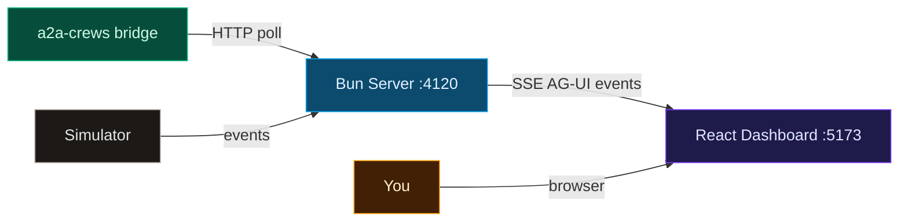

<div align="center">

# 🎯 ag-ui-crews

### **The cockpit for your AI agent crews.**

Watch your multi-agent teams think, plan, and build — in real time, in your browser.

[](LICENSE)
[](#tech-stack)
[](https://docs.ag-ui.com)
[](#testing)
[](https://bun.sh)

[Quick Start](#-quick-start) · [Demo](#-see-it-in-action) · [Architecture](#-architecture) · [API](#-api-reference) · [Contributing](#-contributing)

</div>

---

Your AI crew is doing real work — planning tasks, assigning roles, executing in parallel waves, producing artifacts. But right now? It's a wall of terminal logs. **ag-ui-crews** gives you eyes on the operation. A live dashboard that streams every decision, every agent heartbeat, every completed task as it happens. Built on the [AG-UI protocol](https://docs.ag-ui.com), it turns invisible agent orchestration into something you can see, understand, and trust.

---

## 🎬 See It in Action

<div align="center">
  <video src="https://github.com/aviraldua93/ag-ui-crews/raw/main/docs/demo.webm" width="100%" autoplay loop muted></video>
</div>

<br />

<details>
<summary><strong>📸 Screenshots (click to expand)</strong></summary>
<br />

<table>
  <tr>
    <td align="center">
      
      <br /><strong>Auto-Discovery</strong><br />
      <sub>Finds running crews automatically — click to connect</sub>
    </td>
    <td align="center">
      
      <br /><strong>Live Dashboard</strong><br />
      <sub>Real agents, real tasks, real-time metrics from a2a-crews bridge</sub>
    </td>
  </tr>
  <tr>
    <td align="center" colspan="2">
      
      <br /><strong>Real-Time Metrics</strong><br />
      <sub>Task completion, agent status, wave progress — all from live bridge polling</sub>
    </td>
  </tr>
</table>

</details>

---

## 🔺 The Agentic Stack

We're in the middle of a protocol revolution. Three open standards are reshaping how AI agents work — with tools, with each other, and with us.



| Protocol | Role | Think of it as… |
|----------|------|-----------------|
| **[MCP](https://modelcontextprotocol.io)** | Agent ↔ Tools | USB-C for AI — plug into any data source |
| **[A2A](https://a2aproject.org)** | Agent ↔ Agent | The team Slack — agents coordinate and delegate |
| **[AG-UI](https://docs.ag-ui.com)** | Agent ↔ Human | The glass cockpit — humans see and steer |

**ag-ui-crews sits at the intersection of A2A and AG-UI.** [a2a-crews](https://github.com/aviraldua93/a2a-crews) orchestrates agent teams using A2A. ag-ui-crews makes that orchestration visible using AG-UI. Together, they close the loop:

> **Humans → Agents → Tools → Agents → Humans**

---

## ⚡ Why ag-ui-crews?

|  | ag-ui-crews | CopilotKit | LangGraph Studio | CrewAI Dashboard |
|--|:-----------:|:----------:|:----------------:|:----------------:|
| Protocol-native (AG-UI) | ✅ | ✅ (creator) | ❌ | ❌ |
| Multi-agent wave visualization | ✅ | ❌ | ✅ | ❌ |
| Feasibility assessment UI | ✅ | ❌ | ❌ | ❌ |
| Real-time SSE streaming | ✅ | ✅ | ✅ | Polling |
| Simulation mode (no agents needed) | ✅ | ❌ | ❌ | ❌ |
| Zero config | ✅ | Config needed | Cloud only | Cloud only |
| Open source | ✅ MIT | ✅ | ❌ | ❌ |

---

## ✨ Features

<table>
<tr>
<td>

🔍 **Feasibility Assessment**<br/>
<sub>AI-powered go / risky / no-go verdict before work begins</sub>

</td>
<td>

🌊 **Wave Timeline**<br/>
<sub>Parallel execution waves with task dependencies visualized</sub>

</td>
<td>

🤖 **Agent Status Cards**<br/>
<sub>Live pulse animations, role assignments, task progress</sub>

</td>
</tr>
<tr>
<td>

📊 **Metrics Dashboard**<br/>
<sub>Tasks, waves, agents, elapsed time, completion percentage</sub>

</td>
<td>

📦 **Artifact Viewer**<br/>
<sub>Browse deliverables produced by each agent</sub>

</td>
<td>

📜 **Event Log**<br/>
<sub>Scrolling, filterable log of every AG-UI protocol event</sub>

</td>
</tr>
<tr>
<td>

🎭 **Simulation Mode**<br/>
<sub>Full crew lifecycle demo — no agents or API keys needed</sub>

</td>
<td>

🌉 **Live Bridge Connector**<br/>
<sub>Connect to running a2a-crews for real agent monitoring</sub>

</td>
<td>

🧪 **106 Tests**<br/>
<sub>95 Vitest unit + 11 Playwright E2E — CI-ready</sub>

</td>
</tr>
</table>

---

## 🚀 Quick Start

```bash
git clone https://github.com/aviraldua93/ag-ui-crews.git
cd ag-ui-crews && bun install
bun run dev   # → http://localhost:5173
```

Click **"Run Simulation"** and watch a full crew execution unfold — feasibility check, agent registration, wave-by-wave task execution, artifact production, and completion. No agents required.

> **Prerequisite:** [Bun](https://bun.sh) ≥ 1.0

---

## 🌉 Connect to a Live Crew

Two terminals. That's it.

```bash
# Terminal 1 — launch your agent crew
cd your-project
crews plan "Build a REST API with auth and tests"
crews apply
crews launch
```

```bash
# Terminal 2 — open the dashboard
cd ag-ui-crews && bun run dev
# Click "Connect to Bridge" → paste the bridge URL from crews output
```

The dashboard connects to the [a2a-crews](https://github.com/aviraldua93/a2a-crews) bridge, polls for state changes, and streams every event to your browser in real time.

---

## 🏗 Architecture



**Two data sources, one protocol.** The Bun server accepts events from either a live a2a-crews bridge or the built-in simulator, translates everything into [AG-UI protocol](https://docs.ag-ui.com) events, and streams them to connected clients over SSE. The React dashboard consumes the stream and renders the crew's state in real time.

---

## 📡 AG-UI Protocol Events

Every event flowing through the dashboard follows the [AG-UI protocol](https://docs.ag-ui.com) specification:

| Event Type | What It Shows in the UI |
|------------|-------------------------|
| `RUN_STARTED` / `RUN_FINISHED` | Session begins → completion banner |
| `STEP_STARTED` / `STEP_FINISHED` | Phase transitions (planning → wave-0 → wave-1 → …) |
| `TEXT_MESSAGE_START` / `CONTENT` / `END` | Streaming plan summaries, task updates |
| `STATE_SNAPSHOT` | Full dashboard hydration on connect |
| `STATE_DELTA` | Incremental state patches (agent status, task progress) |
| `TOOL_CALL_START` / `ARGS` / `END` | Tool invocations rendered in event log |
| `CUSTOM` | Domain events — `CREW_PLAN_*`, `WAVE_*`, `AGENT_*`, `TASK_*`, `ARTIFACT_PRODUCED`, `BRIDGE_*`, `METRICS_UPDATE` |

---

## 📖 API Reference

The server runs on port **4120** (configurable via `PORT` env var).

| Method | Endpoint | Description |
|--------|----------|-------------|
| `GET` | `/events` | SSE stream of AG-UI protocol events. Sends `STATE_SNAPSHOT` on connect. |
| `POST` | `/api/simulate` | Start a simulation. Body: `{ scenario?, speedMultiplier?, failureRate? }` |
| `POST` | `/api/connect` | Connect to a live a2a-crews bridge. Body: `{ "bridgeUrl": "http://..." }` |
| `POST` | `/api/stop` | Stop the current session (bridge or simulation). Resets state. |
| `GET` | `/api/state` | Current dashboard state as a JSON snapshot. |
| `GET` | `/api/health` | Health check — uptime, client count, bridge/simulation status. |

---

## 🛠 Tech Stack

| Layer | Technology |
|-------|-----------|
| **Runtime** | [Bun](https://bun.sh) — fast JS runtime, bundler, and test runner |
| **Frontend** | [React 19](https://react.dev) · [TypeScript](https://www.typescriptlang.org/) (strict) · [Vite 6](https://vite.dev) |
| **Styling** | [Tailwind CSS 4](https://tailwindcss.com) · [Framer Motion](https://www.framer.com/motion/) |
| **Protocol** | [AG-UI](https://docs.ag-ui.com) via [`@ag-ui/core`](https://www.npmjs.com/package/@ag-ui/core) |
| **Testing** | [Vitest](https://vitest.dev) (unit) · [Playwright](https://playwright.dev) (E2E) |

---

## 🧪 Testing

```bash
bun run test        # 95 unit tests (Vitest)
bun run test:e2e    # 11 E2E tests (Playwright)
```

Unit tests cover the event emitter, simulator, SSE integration, AG-UI event translation, and the client-side state reducer. E2E tests drive a real browser through the complete lifecycle — hero landing → planning → wave execution → artifacts → completion.

---

## 🐕 The Dogfood Story

This project was built using [a2a-crews](https://github.com/aviraldua93/a2a-crews) itself.

We ran `crews plan` against the scaffolded project. The AI planner designed a 4-role team — **server-test-author**, **sse-integration-dev**, **e2e-test-author**, **docs-author** — and `crews launch` spawned real agents that wrote the test configs, unit tests, and Playwright E2E suites.

Along the way, we discovered and filed 3 bugs ([#10](https://github.com/aviraldua93/a2a-crews/issues/10), [#11](https://github.com/aviraldua93/a2a-crews/issues/11), [#12](https://github.com/aviraldua93/a2a-crews/issues/12)) back on a2a-crews — making both projects better. Dogfood squared.

---

## 🗺 Roadmap

- [ ] Live bridge auto-discovery (scan localhost ports)
- [ ] Token cost tracking per agent
- [ ] Multi-crew dashboard (watch multiple teams simultaneously)
- [ ] Dark / light theme toggle
- [ ] Mobile-responsive layout
- [ ] Agent log streaming (see what each agent is thinking)
- [ ] A2A ↔ AG-UI protocol bridge (bidirectional)
- [ ] CopilotKit integration for human-in-the-loop control

---

## 🤝 Contributing

Contributions are welcome! Check out the [open issues](https://github.com/aviraldua93/ag-ui-crews/issues) for ideas, or open a new one if you have a feature request or bug report.

```bash
bun install           # Install dependencies
bun run dev           # Start dev server
bun run test          # Run unit tests
bun run test:e2e      # Run E2E tests
bun run typecheck     # Type check
```

---

## 📄 License

[MIT](LICENSE) © 2026 [Aviral Dua](https://github.com/aviraldua93)

---

<p align="center">
  <strong>Built on</strong>
  <a href="https://docs.ag-ui.com">AG-UI Protocol</a> ·
  <a href="https://github.com/aviraldua93/a2a-crews">a2a-crews</a> ·
  <a href="https://bun.sh">Bun</a> ·
  <a href="https://react.dev">React</a> ·
  <a href="https://a2aproject.org">A2A Protocol</a>
</p>
